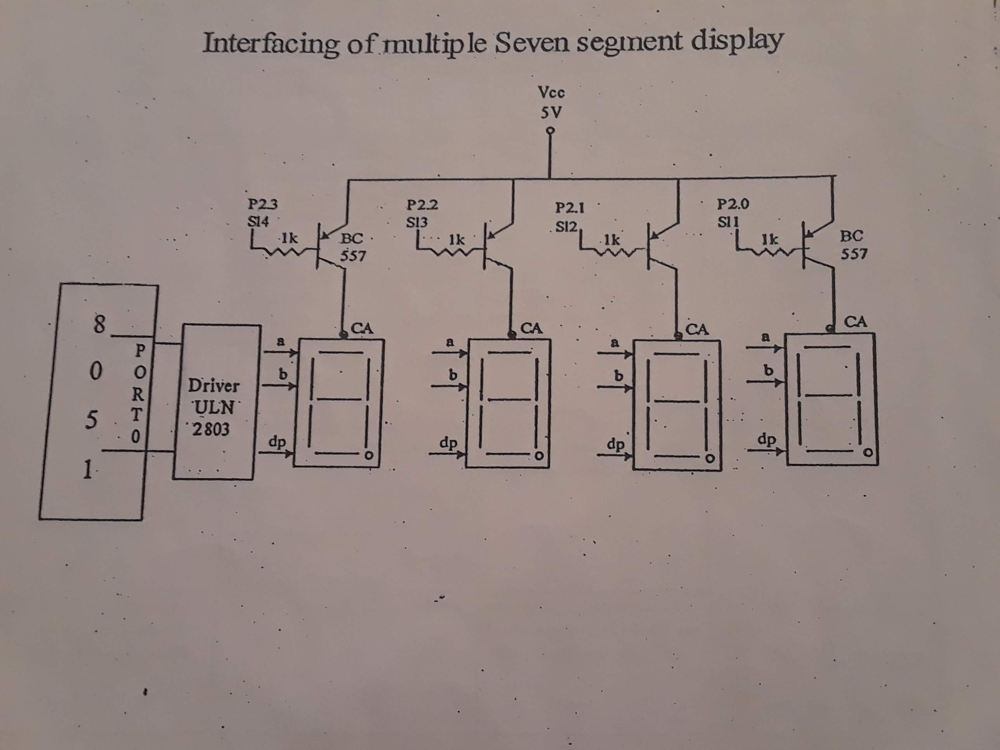
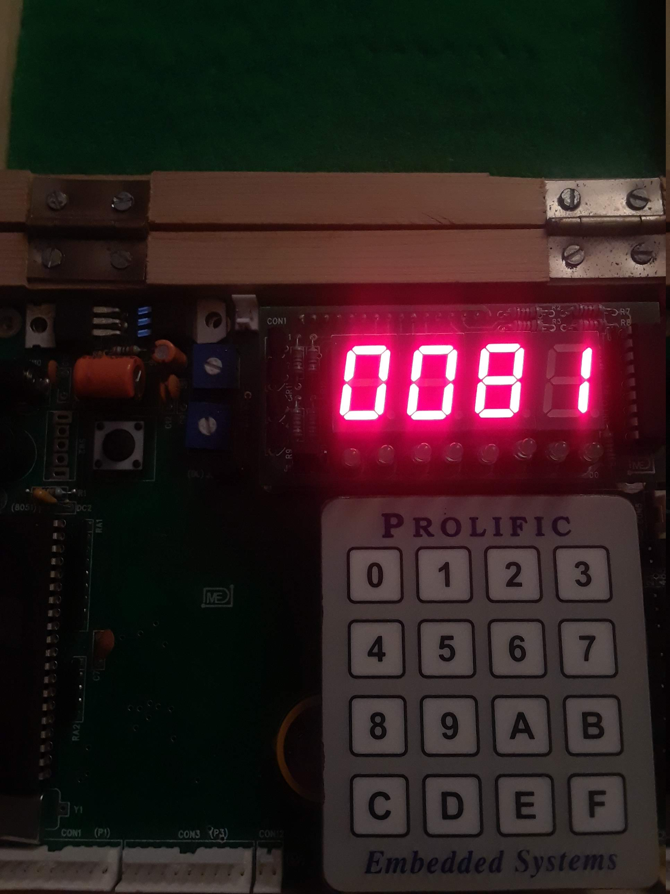

# counter_timer_interrupt
Interrupt based counter using one timer for the display and another timer for increments

## Getting Started

### Requirements
* Keil IDE
* Flash Magic
* 8051 microcontroller
* Driver ULN 2803
* 7-segment displays (x4)

### Installing
1. Connect 7-segment displays to the 8051 microcontroller as shown in the following diagram:
   
1. Open Keil and create new project
   * Choose Philips P89V51RD2 database
1. Add counter_timer_interrupt.c file to Source Group
1. Build target
1. Use Flash Magic to write the resulting hex file to the 8051 microcontroller

### Example

Count starts from 0000 and steadily increments thereafter. In this example the current count is 462.

## Authors

* **Sahil Mahajan**

## License

This project intentionally has no license.

